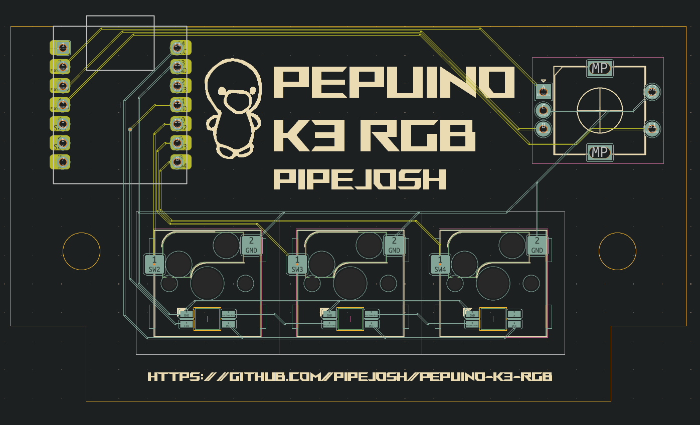
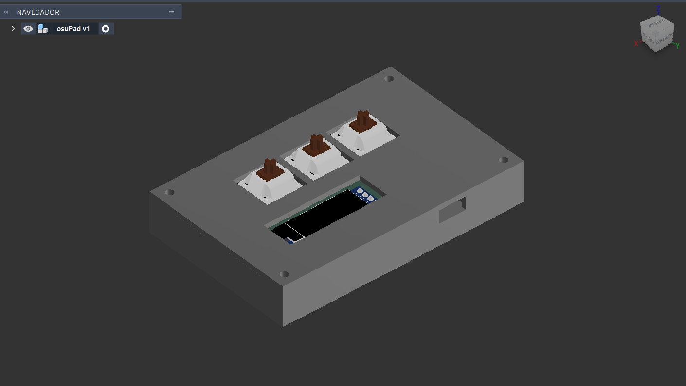

**Osu / Geometry dash pad**

This project is a little  pad for geomeotry dash or osu (or any other rithm game that includes tappin a mouse or keyboard), this little pad has 3 keys, that can be programmed to be anything, in this case they are programmed to be Z, X, and W, it also has a oled screen, that has stadistic, like the current hour

I made this project because I felt like it was time to jump from keyboard to this little pad, I was orignally gonna buy one, but what a better opportunity to learn how to make one myself.

### Pcb Image
 

### Case 3d model
 

### Schematic pcb
 

<!-- ### BOM -->

<!-- -->
