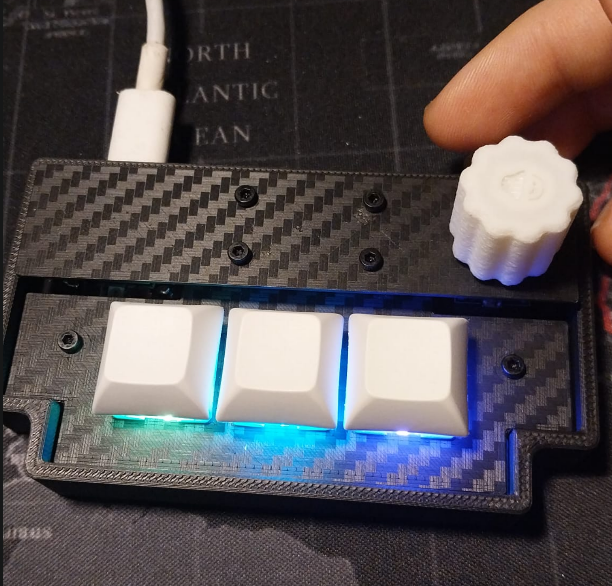
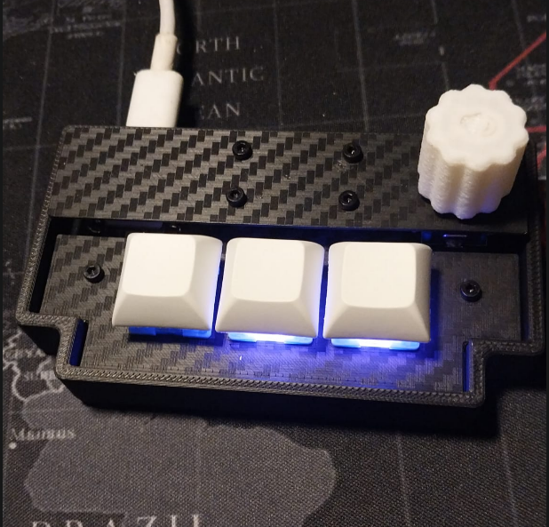
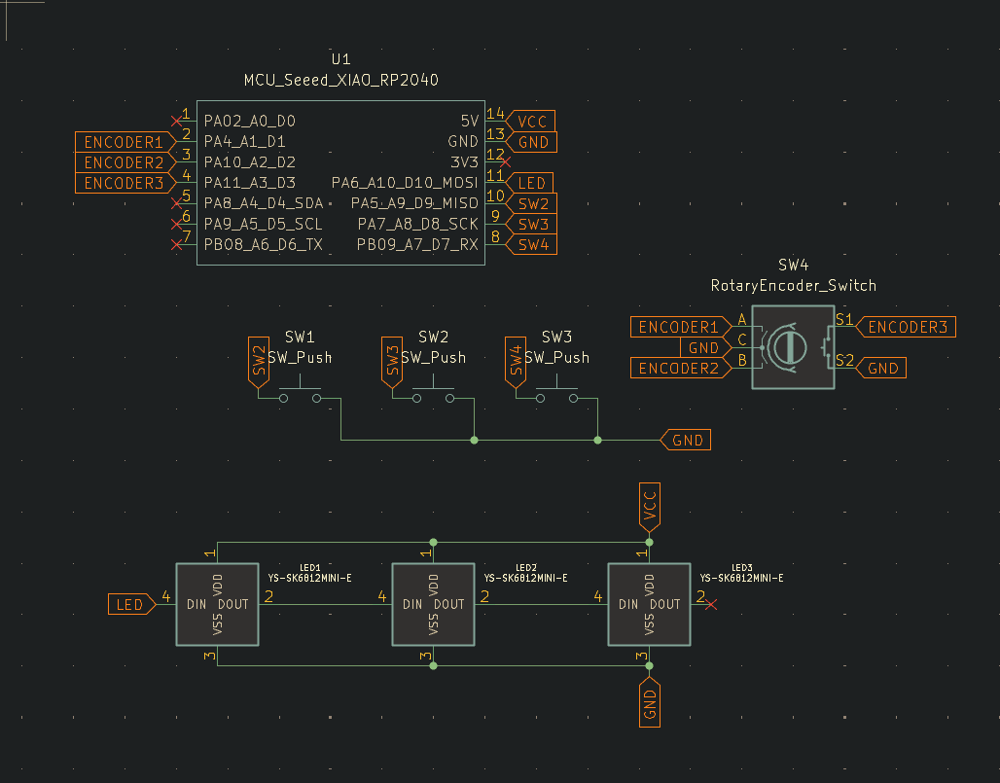
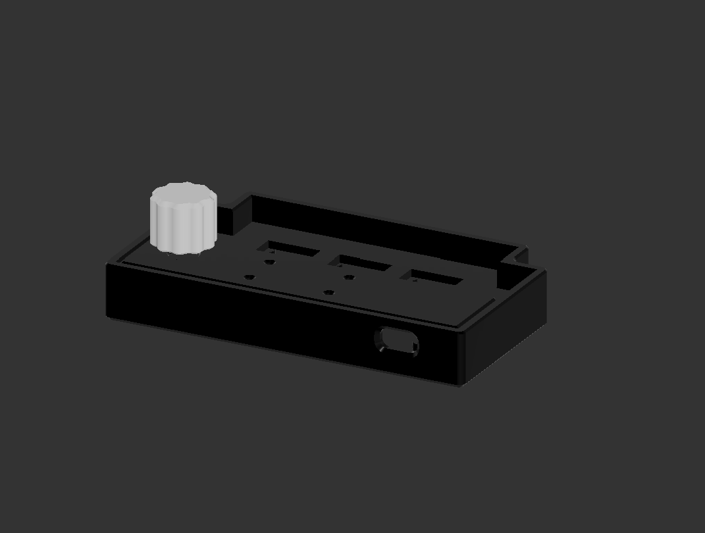
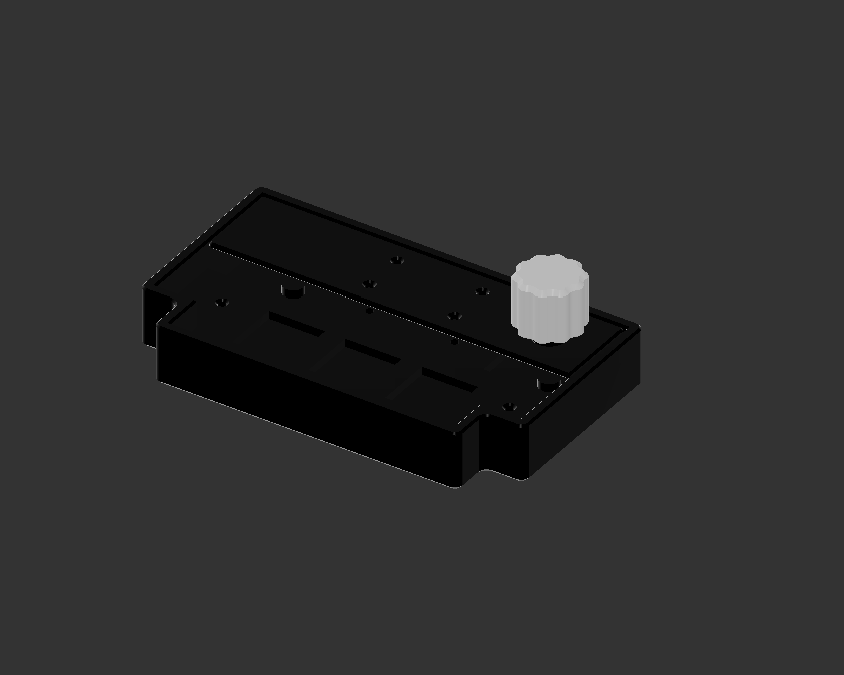

# Pepuino K3 RGB 

Introducing the Pepuino K3 RGB, this is a custom macro pad made from scratch, currently designed to fit any rythm game like osu or geometry dash. The Pepuino K3 has 3 programable switches per light RGB lightning and a rotary encoder.

I made this project because I felt like it was time to jump from keyboard to a more small macro pad. I was orignally gonna buy one, but what a better opportunity to learn how to make one myself.

## Mode

In this current set up I have 2 layers, the Osu mode (ESC, z , x) and the Geometry Dash mode (Space , z , x) you can difference them by the led profile, the purple for Osu and the rainbow for Geometry Dash 

 
 

# Technical stuff

### SCHEMATIC DIAGRAM
 

### PCB 
 

### CASE RENDER
 
 

